# API Testing Report - JSONPlaceholder & Weather API

## Project Information

| Field | Value |
|---|---|
| Project Name | REST API Testing Practice |
| Tester | [Your Name] |
| Tool | Postman |
| API Type | REST API |
| Test Type | Manual API Testing |
| Date | [Testing Date] |

---

# 1. Objective

Mục tiêu của bài kiểm thử:

- Thực hành kiểm thử REST API bằng Postman
- Kiểm tra các phương thức:
  - GET
  - POST
  - PUT
  - DELETE
- Kiểm tra xử lý lỗi với dữ liệu không hợp lệ
- Thực hành sử dụng:
  - Collection
  - Environment
  - Variables
  - Test Scripts
  - Collection Runner

---

# 2. APIs Used

## 2.1 JSONPlaceholder API

Base URL:

```http
https://jsonplaceholder.typicode.com
```

Dùng để kiểm thử CRUD APIs.

---

## 2.2 Weather API

Base URL:

```http
http://api.weatherapi.com/v1
```

Dùng để thực hành GET API với query parameters.

---

# 3. Environment Configuration

## Environment Variable

| Variable | Value |
|---|---|
| `baseUrl` | `https://jsonplaceholder.typicode.com` |

---

# 4. Setup Process

## 4.1 Create Collection

Tên collection:

```text
Lab7
```

### Screenshot

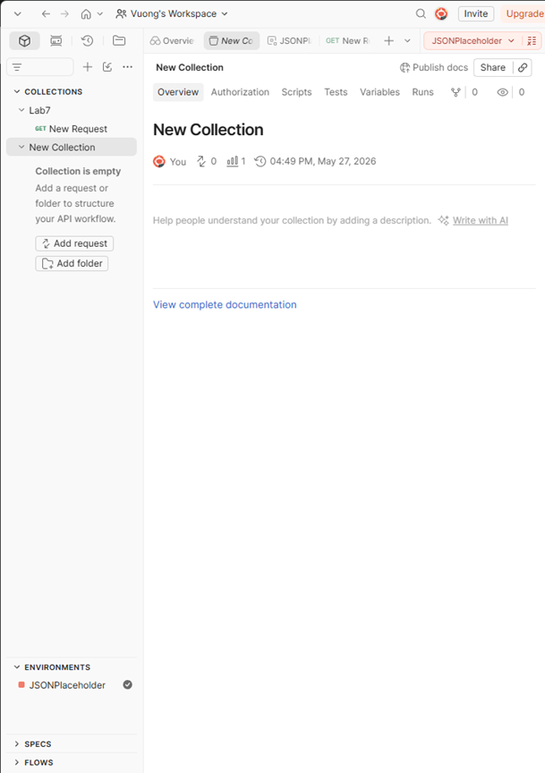

---

## 4.2 Create Environment

Tên Environment:

```text
JSONPlaceholder
```

### Screenshot

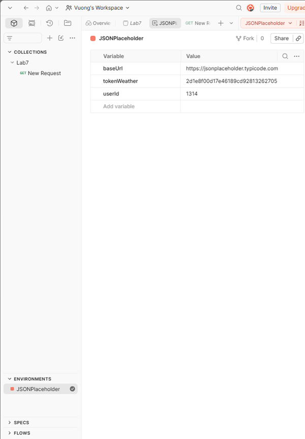

---

## 4.3 Add Environment Variable

| Variable | Initial Value |
|---|---|
| baseUrl | https://jsonplaceholder.typicode.com |

### Screenshot


---

## 4.4 Attach Environment

Environment được gắn vào workspace để sử dụng biến `{{baseUrl}}`.

### Screenshot

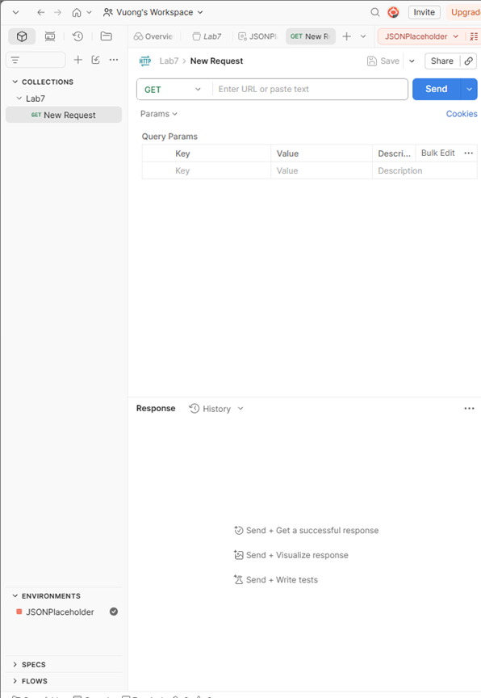

---

# 5. Test Cases

| TC ID | Test Case | Method | Endpoint | Expected Result | Actual Result | Status |
|---|---|---|---|---|---|---|
| TC01 | Get Post | GET | `/posts/1` | 200 OK | 200 OK | PASS |
| TC02 | Create Post | POST | `/posts` | 201 Created | 201 Created | PASS |
| TC03 | Update Post | PUT | `/posts/1` | 200 OK | 200 OK | PASS |
| TC04 | Delete Post | DELETE | `/posts/1` | 200 OK | 200 OK | PASS |
| TC05 | Get Huge ID | GET | `/posts/99999999` | API handles invalid ID | 404 Not Found | PASS |
| TC06 | Get Negative ID | GET | `/posts/-999` | API handles invalid ID | 404 Not Found | PASS |

---

# 6. API Requests

---

# 6.1 GET Request

## Endpoint

```http
GET {{baseUrl}}/posts/1
```

## Test Script

```javascript
pm.test("Status code is 200", function () {
    pm.response.to.have.status(200);
});
```

## Result

- Status Code: 200 OK
- Test Result: PASS

### Screenshot

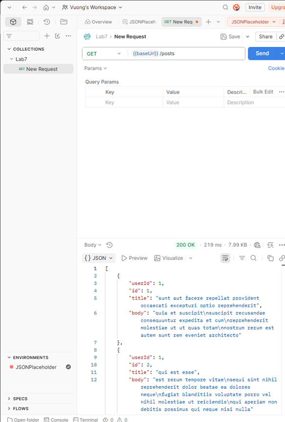

---

# 6.2 POST Request

## Endpoint

```http
POST {{baseUrl}}/posts
```

## Request Body

```json
{
  "title": "Test Postman",
  "body": "Learning API Testing",
  "userId": 1
}
```

## Test Script

```javascript
pm.test("Status code is 201", function () {
    pm.response.to.have.status(201);
});
```

## Result

- Status Code: 201 Created
- Test Result: PASS

### Screenshot

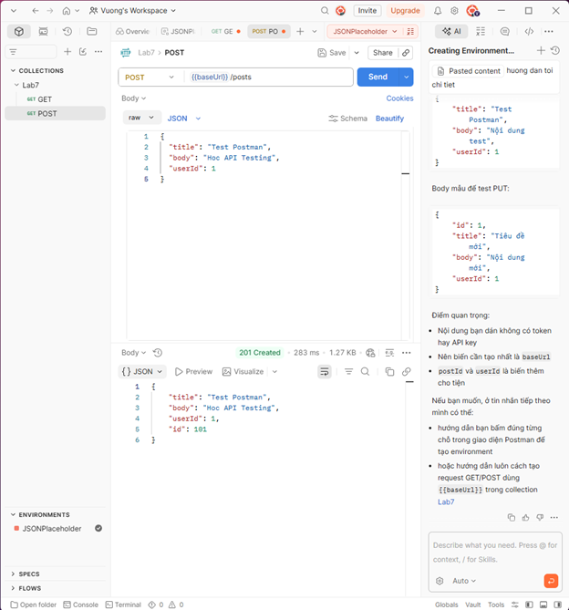

---

# 6.3 PUT Request

## Endpoint

```http
PUT {{baseUrl}}/posts/1
```

## Request Body

```json
{
  "id": 1,
  "title": "Updated Title",
  "body": "Updated Content",
  "userId": 1
}
```

## Test Script

```javascript
pm.test("PUT success", function () {
    pm.response.to.have.status(200);
});
```

## Result

- Status Code: 200 OK
- Test Result: PASS

### Screenshot

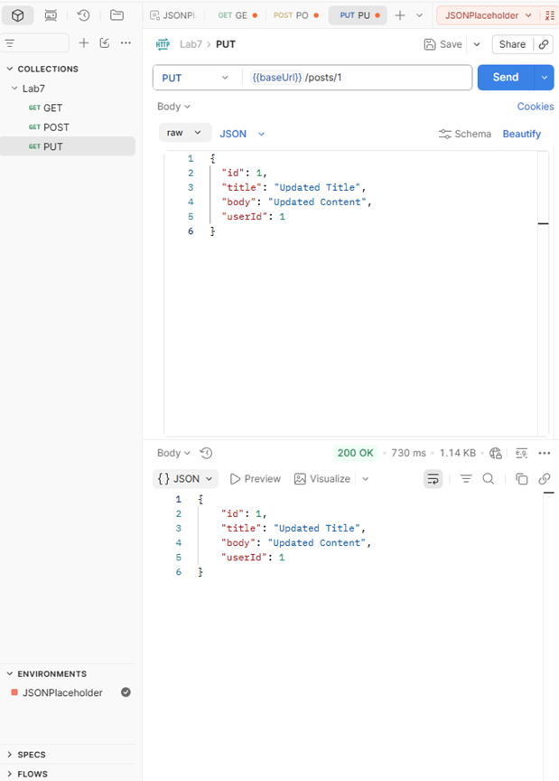

---

# 6.4 DELETE Request

## Endpoint

```http
DELETE {{baseUrl}}/posts/1
```

## Test Script

```javascript
pm.test("DELETE success", function () {
    pm.response.to.have.status(200);
});
```

## Result

- Status Code: 200 OK
- Test Result: PASS

### Screenshot

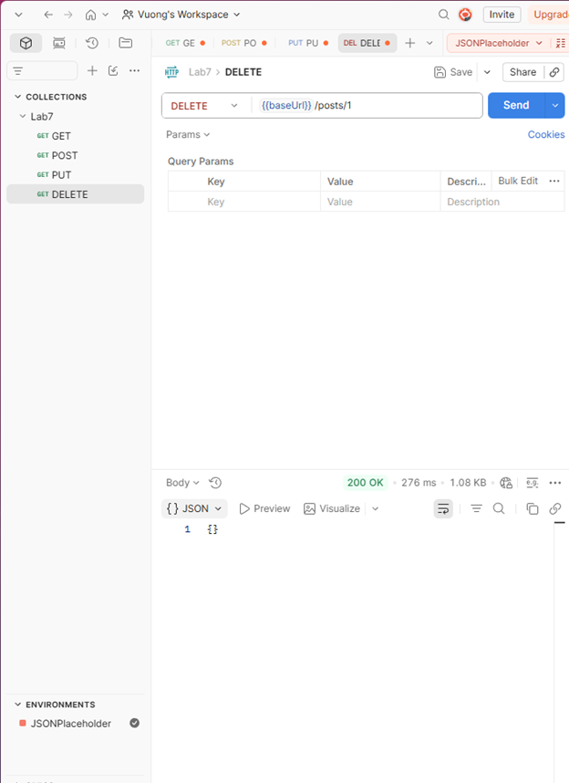

---

# 6.5 GET Huge ID Testing

## Endpoint

```http
GET {{baseUrl}}/posts/99999999
```

## Purpose

Kiểm thử API với ID cực lớn để xác minh:
- API không crash
- xử lý lỗi đúng cách
- response time ổn định

## Test Script

```javascript
pm.test("Status code valid", function () {
    pm.expect(
        [200, 404].includes(pm.response.code)
    ).to.be.true;
});

pm.test("Response time under 3s", function () {
    pm.expect(pm.response.responseTime).to.be.below(3000);
});

pm.test("API should not crash", function () {
    pm.expect(pm.response.text()).to.not.include("Internal Server Error");
});
```

## Result

- Status Code: 404
- Test Result: PASS

### Screenshot

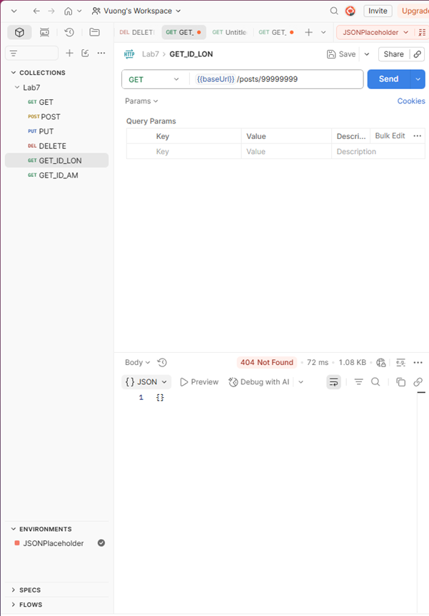

---

# 6.6 GET Negative ID Testing

## Endpoint

```http
GET {{baseUrl}}/posts/-999
```

## Purpose

Kiểm thử API với ID âm.

## Result

- Status Code: 404
- Test Result: PASS

### Screenshot

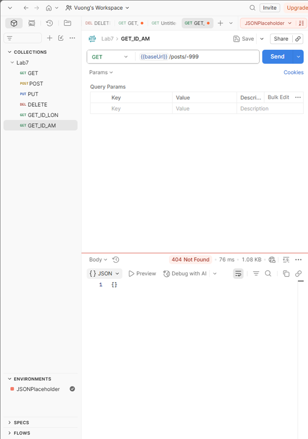

---

# 7. Weather API Testing

## Endpoint

```http
GET http://api.weatherapi.com/v1/current.json
```

## Query Parameters

| Key | Value |
|---|---|
| key | YOUR_API_KEY |
| q | Hanoi |

## Example URL

```http
http://api.weatherapi.com/v1/current.json?key=YOUR_API_KEY&q=Hanoi
```

## Expected Result

- Current weather data returned successfully
- Status code 200 OK

### Screenshot

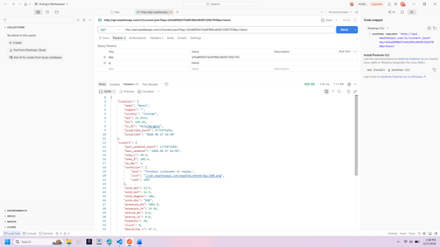

---

# 8. Full Collection Run

Toàn bộ collection được chạy bằng Collection Runner.

## Result Summary

| Metric | Result |
|---|---|
| Total Requests | 6 |
| Passed | 6 |
| Failed | 0 |
| Errors | 0 |
| Success Rate | 100% |

---

# 9. Collection Runner Result

### Screenshot

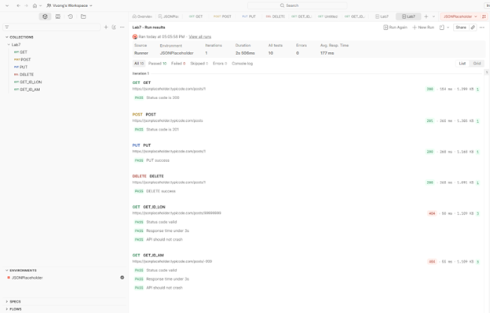

---

# 10. Performance Summary

| Request | Response Time |
|---|---|
| GET | 154 ms |
| POST | 265 ms |
| PUT | 268 ms |
| DELETE | 268 ms |
| Huge ID Test | 50 ms |
| Negative ID Test | 55 ms |

---

# 11. Findings

## Positive Findings

- All CRUD APIs worked correctly
- Response times were stable
- No internal server errors occurred
- Environment variables functioned correctly
- Collection Runner automation succeeded
- Negative testing handled safely

---

# 12. Conclusion

Bài kiểm thử xác nhận rằng:
- REST APIs hoạt động đúng với CRUD operations
- API xử lý dữ liệu không hợp lệ ổn định
- Không phát hiện lỗi nghiêm trọng hoặc crash server
- Postman hỗ trợ hiệu quả cho manual API testing và automation testing